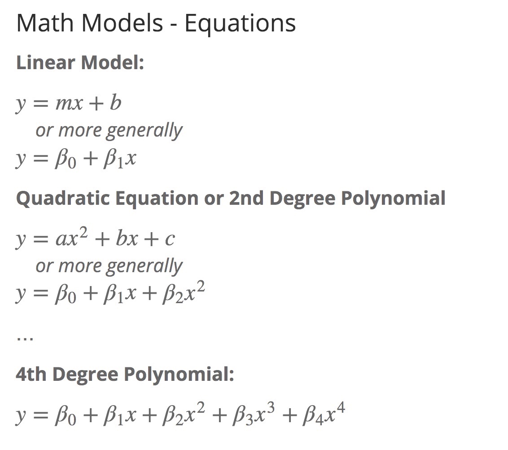

```{r setup, include=FALSE}
knitr::opts_chunk$set(
  echo = FALSE, #TRUE
  warning = FALSE,
  message = FALSE,
  out.height = "300px",
  cache = TRUE
)
# subtitle:
# slide_level: 3 # Use this to override default
# for more info:
# https://support.rstudio.com/hc/en-us/articles/360004672913-Rendering-PowerPoint-Presentations-with-RStudio
```

# Acknowledgements

Put previous slide here

# Big Data & Audiology


# Big Data: Opportunities & Challenges

- Provides opportunities
  - Large cohort sizes
  - Comparison across institutions
  - Compendium of data resources to bring to bear on a problem
  - Rapid testing of hypotheses
- Presents Challenges
  - Observational studies
  - Sparsity of data
  - Significant amounts of data in the form of text, which isn’t readily accessible to computational methods without further work 

# The Audiological and Genetic Database (AudGenDB)

- Pediatric hearing research integrates complex data from varying specialties, on large numbers of patients.
- Examples of data in AudGenDB:
  - Audiogram for hearing thresholds
  - Evoked responses (e.g. ABR) 
  - Speech and language performance 
  - Diagnoses and problems
  - Procedures
  - Temporal bone imaging
 
- Large-scale hearing research projects would benefit from an integrated electronic database that incorporates these varied data.   


# Database Summary

](images/Data Summary Pennington Paper.png)

# Data Science – Machine Learning

Use slide from down's presentation


# Talk Outline

- Work in Progress
- Demonstrate textmining approaches
- Discuss algorithms to identify progression
- Discuss mathematical modeling to facilitate our analyses 
- Touch on how these approaches facilitate the long term goal of predictive analytics

# Hearing Loss Progression

- The larger question – Enlarged Vestibular Aqueduct (EVA) is a subset of the HL Progression problem
- How to determine which patients will progress?
- What computational approaches can we bring to bear on the problem?
- Can machine learning techniques be used to predict HL progression?
- What features are available for inclusion as features?
- Can we generate ‘computed phenotypes’?

# Identifying an EVA Cohort 

- No unique ICD Code
- How to identify the cohort?
    - Track in the clinic (Approach Taken at Boston Children's & Vanderbilt)
    - Text Mining Radiology Reports (CHOP Approach) 
- Radiology Reports are ‘Semi-Structured’
    - Organization is stereotyped
    - Language is idiosyncratic for each clinician
    - (Some believe verbosity is elegant ;-)


# Text Mining for the Term ‘vestibular aqueduct’


# Text Mining for the Term ‘vestibular aqueduct’

- 18,919 radiology impressions in AudGenDB
- 2726 observations can be found with the term, ’vestibular aqueduct`
- 256 impressions have the term more than twice
- Hand-curated 30 of these
    - 21 describe EVA
    - 2 definitely not enlarged
    - 5 used radiology CYA words (ambiguous)
    - 1 duplicate report
    - 1 thin vestibular aqueduct
- A list of specific terms assembled 

# Text Mining: Regular Expressions

Dispositive Expression (5):
Example: (vestibular(\\n| )aqueducts?.+(is|are|with)(\\n| ) ?(mildly|markedly)?(\\n| )(enlarged|dilated|widened))

Exclusionary Expression – Negative (13):
Example: no( |\n)evidence of enlarg(ed|ement of the) vestibular aqueducts?

Exclusionary Expression – Ambiguous (4):
Example: may represent\nenlarged vestibular aqueducts

# Text Mining: Regular Expressions

- 13,289 radiology impressions in AudGenDB
- 6,255 patients
- 206 impressions from 190 patients are found using the regex algorithms
- 344 patients cumulatively at the three institutions represented in AudGenDB

# Computational Methods to Identify HL Progression

- Most in the audience familiar with identifying HL progression using a collection of audiograms from a single patient
- Our task was to develop computational methods that could screen ~400,000 audiograms in AudGenDB from ~136,000 patients 
- Given the large number of audiograms, we had one luxury: making a rigorous definition
- Our definition: Using masked bone thresholds, find patients whose PTA4 dropped by 10 dB from first to last hearing test.

# HL Progression in AudGenDB

- **135,706 total patients** with audiograms in AudGenDB
- **15,581 patients** fitting inclusion criteria using **masked bone conduction**.
- Inclusion Criteria: Patients must have at least 3 hearing tests that dropped by 10 dB HL or more from first to last hearing test that were tested at 4 frequencies (500, 1000, 2000, and 4000 Hz).
- 390 patients with HL progression defined by these criteria

# Sample of Patients Demonstrating HL Progression 


::: notes
Graph from < file:///Users/ebciii3/Public/AudGenDB%20Data%20Mining/Hearing%20Loss%20Progression/html/TemporalGraphsHLprogressionCohort.html#data_analysis > HL103 Temporal Graphs of HL Progression Cohort
:::


# HL Progression in EVA Patients

- Changed definition: Our definition: Using **air thresholds**, find patients whose PTA4 dropped by 10 dB from first to last hearing test.
- For routine monitoring of EVA patients, only air thresholds were measured
- 155 patients (of the 190 found at CHOP) have enough audiogram data for analysis (at least 3 audiograms with all PTA4 frequencies included)
- 60 patients demonstrated progressive hearing loss
- 39% of the qualifying EVA patients have progressive hearing loss

# Identifying Patients with Fluctuating Hearing

- Approach: Calculate difference in PTA 4 from test to test as the patient ages
- Definition: Maximum >= 10 dB between tests & minimum <= -10 dB between tests
- In other words, test-to-test change must go up at least 10 dB and drop by at least 10 dB
- Results
  - 190 total CHOP patients with EVA
  - 155 patients meet all inclusion criteria using **air conduction** for testing
  - 71 ears from 60 patients showed progression demonstrated progressive hearing loss
  - **36 ears that qualify as fluctuating** in the entire data set 
  - 19.9% of the hearing tests
  - **13 ears with fluctuating hearing thresholds** among the **progressive HL patients**

# Examples of Fluctuation in EVA Patients


# Mathematical Modeling to Identify Progression Types

:::::: {.columns}
::: {.column}

- Sudden hearing loss is a prominent feature of HL Progression
- Can we use mathematical modeling to categorize HL Progression profiles?

Note: add images/MathModelsHLprogression.jpeg here

:::
::: {.column}

- Model each patients *pta4 ~ age* curve
- Extract variable values
  - linear (m/b1, b/b0, r2)
  - 4th order polynomial (b4, b3, b2, b1, b0, r2)
  
Clustering

Note add < images/ClusterHLprogression_small.png > here

:::
::::::

# Mathematical Modeling to Identify Progression Types

:::::: {.columns}
::: {.column}



:::
::: {.column}


:::
::::::

# Mathematical Modeling:
## Theoretical Curves

:::::: {.columns}
::: {.column}

- Sudden Hearing Loss is best modeled with 4th degree polynomial
  - **Linear model** fits the data **poorly**, which is reflected in a low r2 value
  - **4th order polynomial model** fit is **good**, and r2 value is high

:::
::: {.column}

- Slow HL Progression is well-modeled with both approaches
  - **Linear model** fit is **good** and r2 value is high
  - **4th order polynomial** is **good**, and r2 value is high
  
:::
::::::

# Mathematical Modeling to Identify Progression Types

:::::: {.columns}
::: {.column}


:::
::: {.column}


:::
::::::

# Clustering HL Progression Profiles (PTA4 ~ Age)


# Two Categories of Sudden Hearing Drop Profiles Distinguished by Clustering: CHOP EVA Cohort

:::::: {.columns}
::: {.column}


:::
::: {.column}


:::
::::::

# Conclusions

- Big Data in hearing sciences requires development of new computational methods to characterize hearing data
- Text mining approaches can be used to identify patient cohorts that have traditionally taken considerable effort to find
- Algorithms have been developed to identify temporal patterns in hearing tests relevant to hearing research, such as HL progession and fluctuation 
- These approaches can digest large datasets, and provide 'features' for machine learning
- In the long term, predictive analytical techniques using these approaches can be developed
- Clinical decision support (CDS) systems can then incorporate predictive analytic models to facilitate the evaluation of patients in audiological and otolaryngological practices

# AudGenDB Home Page

:::::: {.columns}
::: {.column}
AudGenDB website is found at https://audgendb.chop.edu/.

:::
::: {.column}

[](https://audgendb.chop.edu/)]

:::
::::::

# Questions?

#

# Distribution of Patients in AudGenDB


